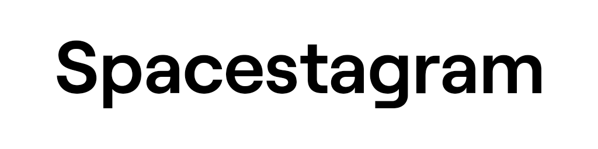
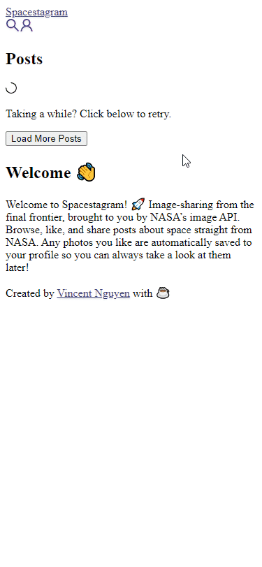
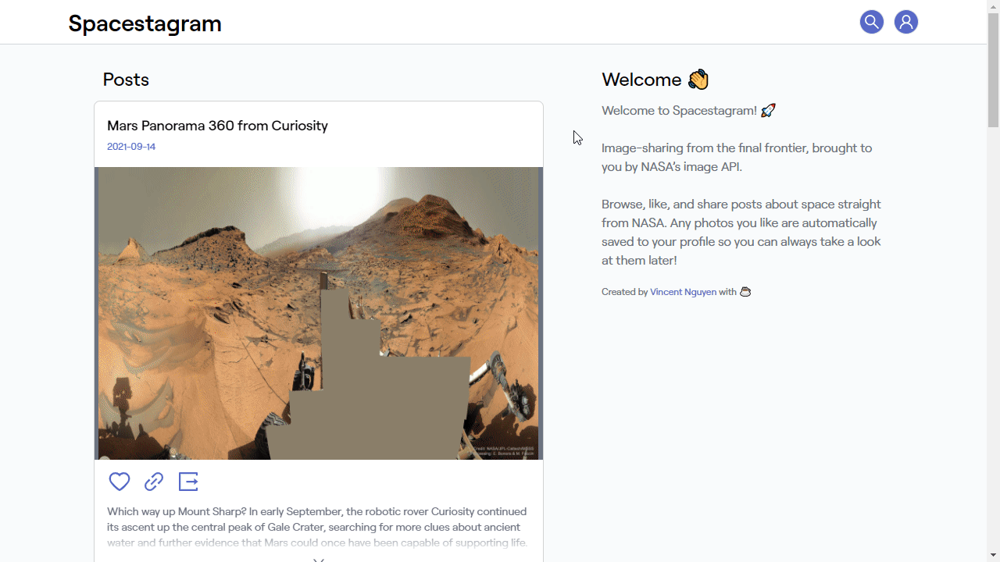

<div align="text-align:center">
  
</div>

Presenting **Spacestagram**, *image-sharing from the final frontier*.

- You can find the live deployment [here](https://shopify-frontend-challenge-w22.vercel.app/)
- [Challenge specification](https://docs.google.com/document/d/1QlC6htA5SXEl3YruAOkJWj2-0W3w-n0UOzGuJ1EcktQ/edit)

## 🔍 Preview

### 📱 Mobile



### 💻 Desktop



## 📚 Table of Contents

- [🔍 Preview](#-preview)
  - [📱 Mobile](#-mobile)
  - [💻 Desktop](#-desktop)
- [📚 Table of Contents](#-table-of-contents)
- [🚀 Features](#-features)
- [🔧 Getting Started](#-getting-started)
  - [Run Development Environment](#run-development-environment)
  - [Build for Production](#build-for-production)
- [🎨 Design](#-design)
- [👩‍💻 Technologies and Libraries Used](#-technologies-and-libraries-used)
- [♿ Accessibility](#-accessibility)
- [🧪 Testing](#-testing)
- [📝 Notes](#-notes)

## 🚀 Features

The user may:

- Load 5 photos at a time
- Save liked photos to local storage
- Search for a specific photo by date
- View saved photos
- Double click a photo to like/unlike the photo
- Click on the heart icon to like/unlike a photo
- Click on the link icon to go to the direct search page
- Click on the outgoing icon to get the high definition photo
- Animations have been added to improve the user experience
  - Loading photos
  - Liking a post
  - And more

## 🔧 Getting Started

You can clone this repository by using the command line:

```bash
git clone https://github.com/vinhvn/shopify-frontend-challenge-w22 app
cd app
yarn # npm i
```

Remember to install dependencies after cloning it locally.

### Run Development Environment

```bash
yarn dev # npm run dev
```

### Build for Production

```bash
yarn build # npm run build
```

## 🎨 Design

All designs, including a design system, were created prior to any development, with a mobile first approach, and are available on Figma.

- [Figma file](https://www.figma.com/file/VRQiOIdvgQdqHjx20rhRhE/Spacestagram?node-id=0%3A1)
- [Mobile](https://www.figma.com/file/VRQiOIdvgQdqHjx20rhRhE/Spacestagram?node-id=2%3A16)
- [Desktop](https://www.figma.com/file/VRQiOIdvgQdqHjx20rhRhE/Spacestagram?node-id=2%3A15)

## 👩‍💻 Technologies and Libraries Used

- React
- TypeScript
- Date-fns
- Styled Components
- Twin.macro
- Jest
- [NASA's APOD API](https://github.com/nasa/apod-api)

Bootstrapped with my [Next.js template](https://github.com/vinhvn/next-typescript-twin-styled-eslint-starter).

## ♿ Accessibility

This web application has a mobile design first principle and is fully responsive on mobile. It also has an accessibility score of 100 according to Google lighthouse. This was achieved using [semantic elements](https://developer.mozilla.org/en-US/docs/Glossary/Semantics) and aria labels using [a11yproject's checklist](https://www.a11yproject.com/checklist/).

## 🧪 Testing

Unit tests have been written for all components using Jest. You can run all tests in watch mode by using the command line:

```bash
yarn test # npm run test
```

Alternatively, generate coverage by using the following:

```bash
yarn test:coverage # npm run test:coverage
```

## 📝 Notes

All components were developed from scratch and implemented based on the design system created for this challenge.
